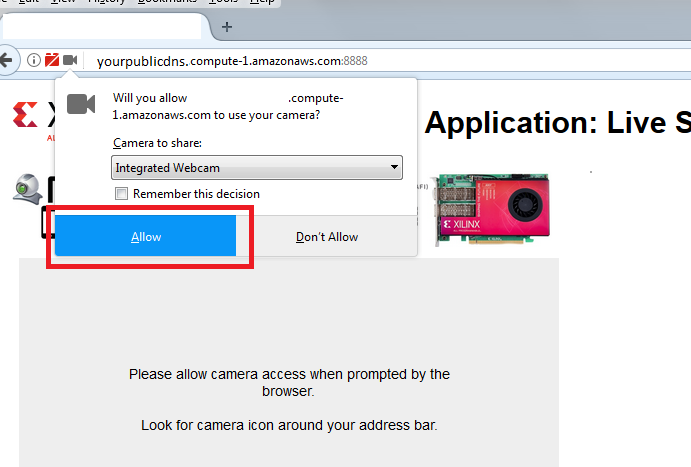
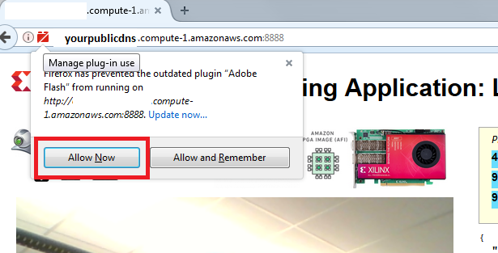
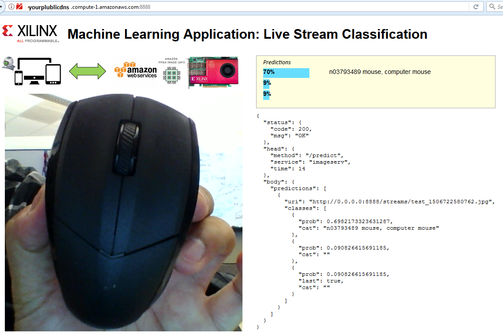

 # DeepDetect Webcam Tutorial

# Introduction
This tutorial expands on the [DeepDetect REST Tutorial][]. Here the [Deep Detect][] application and REST APIs are used to connect a webcam from a host machine and use it to stream video to F1, allowing for classification of live images.

The full code of this project is in `/home/centos/xfdnn_18_03_19/deepdetect/`

For instructions on launching and connecting to instances, see [here][].

Start by launching two Terminals

**Terminal 1**
1. Connect to F1
2. Navigate to `/home/centos/xfdnn_18_03_19/deepdetect/`   

	```
	$ cd /home/centos/xfdnn_18_03_19/deepdetect/
	$ ls
	createService.sh           libs     sdaccel_profile_summary.csv   testService.sh
	dede                       models   sdaccel_profile_summary.html  xclbin
	demo                       run.sh   start_deepdetect_docker.sh    xfdnn_scheduler
	exec_deepdetect_docker.sh  runtime  templates
	```
2. Execute `./start_deepdetect_docker.sh` to enter application docker
3. Navigate to `/opt/deepdetect/`
4. Execute `./runDeepDetectServer.sh` to start the DeepDetect Caffe REST Server

	```
	$ ./start_deepdetect_docker.sh
	# ./runDeepDetectServer.sh
	DeepDetect [ commit  ]

	INFO - 16:03:43 - Running DeepDetect HTTP server on 0.0.0.0:8080

	```

	When you see the message "INFO - 16:03:43 - Running DeepDetect HTTP server on 			0.0.0.0:8080", this indicates  that the script has started the webserver correctly.</br>When the FPGA is ready you will see `XBLAS online! (d=0)`

**Terminal 2:**
1. Connect to F1
2. Navigate to `/home/centos/xfdnn_18_03_19/deepdetect/`

	```
	$ cd /home/centos/xfdnn_18_03_19/deepdetect/
	$ ls
	createService.sh           libs     sdaccel_profile_summary.csv   testService.sh
	dede                       models   sdaccel_profile_summary.html  xclbin
	demo                       run.sh   start_deepdetect_docker.sh    xfdnn_scheduler
	exec_deepdetect_docker.sh  runtime  templates
	```

3. Execute `./createService.sh`
   This initializes the DeepDetect server in Terminal 1. </br>
	 Wait for the FPGA to load xclbin in Terminal 1. </br>
   On success you will see `{"status":{"code":201,"msg":"Created"}}`

4. Navigate to `/home/centos/xfdnn_18_03_19/deepdetect/demo/webcam`
5. Edit `index.html` (using a text editor such as vi or nano).
	Find the section below:
	```html
	/*******************************************
	* TODO: Please update the address below
	* in 'url' to point to your public IP
	*******************************************/
	var url = null;
	```
	Change yourpublicdns.compute-1.amazonaws.com to your instance's public IP address from EC2.

        ```
	var url = "<yourpublicdns>.compute-1.amazonaws.com:8888";
        ```

   This is for the client browser to upload webcam images to server.py
6. Navigate to `/home/centos/xfdnn_18_03_19/deepdetect/`
7. Execute ./exec_deepdetect_docker.sh
8. Navigate to `/opt/deepdetect/demo/webcam/`
9. Execute `python server.py`
   This starts the webcam demo webpage and server.
   ```
	$ cd demo/webcam/
	$ ls
	css  index.html  jpeg_camera  media  README  server.py  streams  test.html
	$ nano index.html
	$ cd ../..
	$ ./exec_deepdetect_docker.sh
	# cd demo/webcam/
	# python server.py
	serving at port 8888
	```

Once you see `serving at port 8888` the application is running and ready.

**Host PC:**
1. In Firefox visit http://<yourpublicdns>.compute-1.amazonaws.com:8888

	**Note**: Firefox browser is recommended.
	Allow browser permissions for use of the Webcam and Adobe, if needed.

	

	

	Now you should be able to classify images via your webcam

	


[here]: launching_instance.md
[DeepDetect REST Tutorial]: deepdetect_rest.md
[Deep Detect]: https://github.com/beniz/deepdetect
